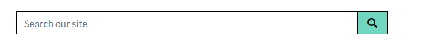
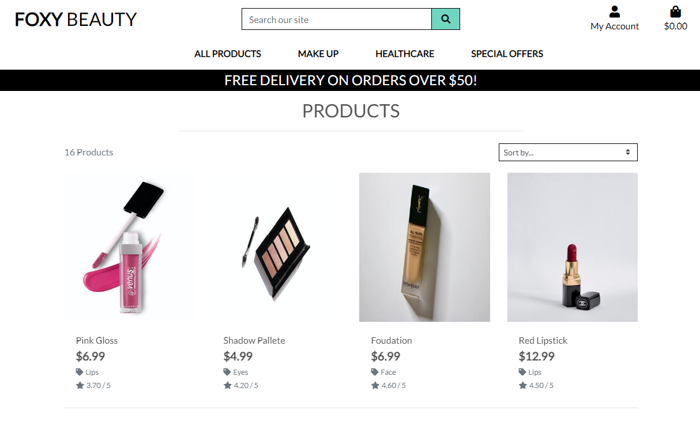
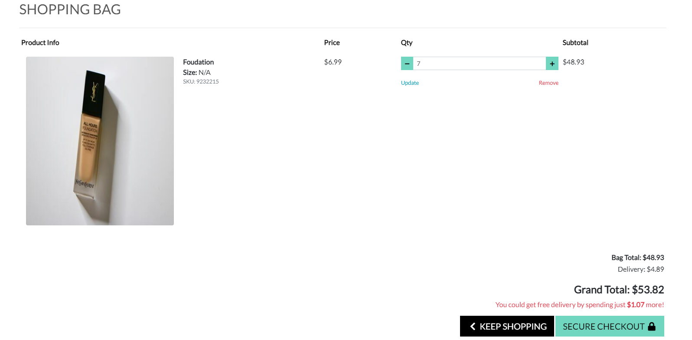
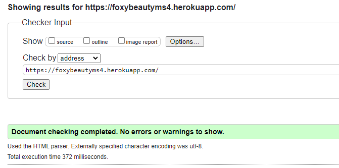
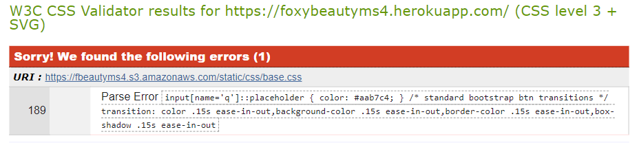
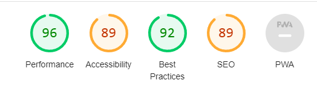

# FOXY BEAUTY - E-Commerce Web App.

### Code Institute - Final Milestone Project (4) - Full Stack Frameworks With Django.

Foxy Beauty is a beauty store with hand picked items for you! Our collection ranges from make ups to skincare products.


The live website can be found [here](https://foxybeautyms4.herokuapp.com/)


## Table of Contents

* [User Experience Design (UX)](#user-experience-design)
* [User Interface (UI)](#user-interface)
* [Wireframes](#wireframes)
* [Database model)](#database-model)
* [Features](#features)
* [Deployment](#deployment)
* [Technologies Used](#technologies-used)
* [Testing](#testing)
* [Known Issues](#known-issues)
* [Credits](#credits)
* [Acknowledgements](#acknowledgements)

# User Experience Design (UX)

## Initial Discussion

* I wanted to create a website linked to a database, which allows users to log in, search for and find products to buy them.
* I wanted to be able to add, edit and delete inventory of products for sale.

## As a site owner
 - I want to be able to add new or edit existing products.
 - I want to be able to remove existing products.
 - I want to be able to add new/existing products to "special offers/sale", "featured products".
 - I want to be able to add new, edit or remove existing categories and brands.

## As a customer
 - I want the main purpose of the site to be clear so that I immediately know what the site is intended for upon entering.
 - I want to view a list of products or look for an individual item by its category.
 - I want to be able to view individual product details, product Image, the price and the product description.
 - I want to be able to view order confirmation and save my contact details in my registered Profile
 - I want to easily access my previous orders.
 - I want to be able to contact the store of the website incase I have any issues or questions.

---

# User Interface (UI)
- A responsive Navbar 
- A search function for users to find available products
- A registration/login form for the first time and returning users
- A loading page was implemented to stop poor impressions from data loading slowly
- Forms for the admin to add new or modify existing products

# Wireframes
 - You can find the wireframes [here](https://github.com/brunoroncete/fbeautyms4/blob/main/readme_files/docs/wireframes.md)

---
# Database Model
- [Database model](https://github.com/brunoroncete/fbeautyms4/blob/main/readme_files/docs/deployment.md)

---
# Features

## Existing Features

Web App Sections:
* Navigation bar
    * Navigation bar contains the web-site logo that links to home and is visible on all pages.

* Webshop
    * Standard e-commerce feed of products with the option to sort products and filter them by category name and price. Every product can be added to the cart immediately and links to a product page where the user can read more about it, including picture of product, name, description, price and an add button if they would like to add product.

* User account 
    * Available to registered/logged in users with the purpose of tracking their order history and safely storing shipping details for a smooth checkout.

* Admin account
    * Available users with admin rights with the purpose of having access to the orders, user profiles, as well as product and blog inventory. Majority of the information is stored in the Django admin site but the users can also do common tasks such as adding, editing and deleting products or blog posts through the site.

## Features and Django Apps

Foxy Beauty, [A Django project](https://docs.djangoproject.com/en/3.1/ref/applications/), consists of 9 Django applications listed below. As explained in Django's documentation - a Django application describes a Python package that provides some set of features. Applications may be reused in various projects.

* `about`
* `bag`
* `checkout`
* `contact`
* `home`
* `products`
* `profiles`

The following list of features is structured in a way that should help with understanding how the features are spread throughout the project.

### Search functionality

* A search box in the navigation bar that is accessible on all pages.
* It allows customers to enter keywords associated with the products they wish to purchase.
* The search results are displayed as a feed of products by using the page templates prepared for the `products` Django app.



### Django-allauth feature

* `django-allauth` is a Python package. As written in the [django-allauth docs](https://django-allauth.readthedocs.io/en/latest/), it is an "integrated set of Django applications addressing authentication, registration, account management as well as 3rd party (social) account authentication."
* It provides a set of features such as **signup**, **login**, **logout** and **password change**
* After signing up, a verification e-mail is sent to the registered e-mail to confirm it. Once confirmed, the user can log in with their credentials and access the `profiles` app.
* The links to these features can be found in the navigation, under the **My Account** dropdown menu, as well as on the pages and throughout the web app.

### Automatic e-mails

* An account is working for this project and used as a sender for all verification, reset and confirmation e-mails.
* For example, users receive an order confirmation e-mail after a purchase, account verification e-mail after the registration, password reset e-mail after requesting a password reset, etc.

### Home app

* `home` Django app mainly serving as an introduction to the company and the marketplace.
* Another feature on the home page is the new arrivals section, this section contains 3 pictures of the newest products that are clickable links to the full details of the products.


### Products app

* `products` Django app is where all the logic and templates connected to the product feed and individual products are.



### Bag app

* `bag` Django app is a standard e-commerce functionality which aids the checkout process.
* A cart is always present in the top right corner of the web app. The bag adds a number symbol beside the cart letting the user know how many items they currently have in their bag.
* Users can edit quantity of items or remove them from cart and see price total amount. In order to proceed with checkout, user will be required to register on the site. When user decides to finish shopping, they will need to input their information and credit card details so that purchase can be completed.
* If users try to access their empty carts, there will be a message displayed that nothing has been added yet and encourage them to go to the shop.


### Checkout app

* `checkout` Django app enables users to buy the products online from the webshop.
* The user can fill form with the shipping and payment details to checkout the order.
* A webhook is implemented to the checkout so that the order is successfully processed in case the checkout process gets interrupted. Some reasons might be closing the browser too soon or losing internet connection.
* "payments" are handled through `stripe`. A test purchase can be made with the following details:
    * credit card: 4242 4242 4242 4242
    * expiration date: 04 / 24
    * CVC: 424
    * ZIP: 42424
* After the payment has been processed, the user is presented with the order summary on the order confirmation page.
* logged in buyers can also see their **order history** on the `profiles pages`.



### Profiles app

* `profiles` Django app is available to registered, authenticated users.
* It offers 2 features: order history and saving shipping information.
* **Order history** displays all previous orders per user account.
* Saving shipping information is done through a form which can be edited anytime. This information is what populates the checkout form for the next orders and where shipping information saved during the checkout process is stored.


---
# Deployment

Detailed deployment can be found [here](https://github.com/brunoroncete/fbeautyms4/blob/main/readme_files/docs/deployment.md)


---
# Technologies Used

## Languages Used

-   [HTML5](https://en.wikipedia.org/wiki/HTML5)
-   [CSS3](https://en.wikipedia.org/wiki/Cascading_Style_Sheets)
-   [Jquery](https://en.wikipedia.org/wiki/Jquery)
-   [Python3](https://en.wikipedia.org/wiki/Python_Programming_Language)

## Frameworks, Libraries & Programs Used

1. [Bootstrap 5.x:](https://getbootstrap.com/)
    - Bootstrap 5.x was used to assist with the responsiveness and styling of the website.
2. [Font Awesome 5:](https://fontawesome.com/)
    - Font Awesome was used on all pages throughout the website to add icons for aesthetic and UX purposes.
3. [jQuery:](https://jquery.com/)
    - jQuery came with bootstrap to make the navbar entire site responsive.
4. [Git](https://git-scm.com/)
    - Git was used for version control by utilizing the Gitpod terminal to commit to Git and Push to GitHub.
5. [GitHub:](https://github.com/)
    - GitHub is used to store the projects code after being pushed from Git. 
6. [Balsamiq:](https://balsamiq.com/)
    - Balsamiq was used to create the [wireframes](https://github.com/) during the design process.
7. [Heroku:](https://heroku.com/)
    - Heroku was used to create  and deploy our app.    
8. [Django:](https://django.com/)
    - Django was used to create the framework.
9. [Postgresql:](https://postgresql.org/)
    - Mongodb was used to create database and to connect server to our site.
10. [Stripe:](https://stripe.com/)
    - Stripe was used to accept and authorise payment for any item purchased on the site.
11. [AWS:](https://s3.console.aws.amazon.com/)
    - Amazon S3 was used to manage and save media and static files in Its cloud service.        

---


# Testing

The W3C Markup Validator and W3C CSS Validator Services were used to validate every page of the project to ensure there were no syntax errors in the project.

-   [W3C Markup Validator](https://jigsaw.w3.org/css-validator/#validate_by_input) - <br>
-   [W3C CSS Validator](https://jigsaw.w3.org/css-validator/#validate_by_input) - <br>
-   [Lighthouse](https://https://developers.google.com/web/tools/lighthouse) - <br>

## Testing User Stories from User Experience (UX) Section

### Customer Goals

1. As a customer, I want the main purpose of the site to be clear so that I immediately know what the site is intended for upon entering.
     1. It is clear that the web site is a store.

2. As a customer, I want to be able to view a list of products, so that I can select some to purchase.

     1. Upon entering the site. The homepage navigation bar have links to list of products and categories, user have the option to view all products or search for a specific product.

    
3. As a customer, I want to be able to view individual product details, product Image, the price, the product description and the compatible cartridges.
   1. By clicking on the featured product from the home page, or by viewing all products and selecting one uses can view detailed information about product <br>
   
4. As a customer, I want to be able to view order confirmation and save my contact details in my registered Profile.
   1. After loging in, selecting the option my profile, the user is able to check his orders and update his details.
   
5. As a customer, I want to easily access my previous orders.
       
     1. In my profile the user is able to check all his previous orders <br>
 

## Further Testing

-   The Website was tested on Google Chrome, Mozilla Firefox, Microsoft Edge and Safari browsers.
-   The website was viewed on a variety of devices such as Desktop, Laptop, iPhone SE, iPhone 11, One+ 9 Pro, and iPadPro.
-   A large amount of testing was done to ensure that all pages were linking correctly
-   Friends and family members were asked to review the site and documentation to point out any bugs and/or user experience issues.

# Known Issues

- Parse error on W3C CSS Validator. <br>


# Problems encountered

- When trying to run developer server I was getting django errors. ![Django Errors] (./readme_files/djangoerror.png)
- To **solve** it I added DEFAULT_AUTO_FIELD = 'django.db.models.AutoField' to settings.py.
- The type attribute is unnecessary for JavaScript resources.
- To **solve** it i removed all ```type=text/javascript``` from ```<script>``` tags

# Credits

## Code

-   Code were copied and modified from the Full Stack Frameworks with Django, Boutique Ado Project and Hello Django Testing.

-   Bootstrap5 template was used throughout the project mainly to make site responsive using the [bootstrap 5](https://getbootstrap.com/)

## Content

-   All content was written by the developer.

## Media

-   All Images belong to the copyright owner.

# Acknowledgements

- Student Care and Tutor at Code Institute for their support, especially the tutor Christine.